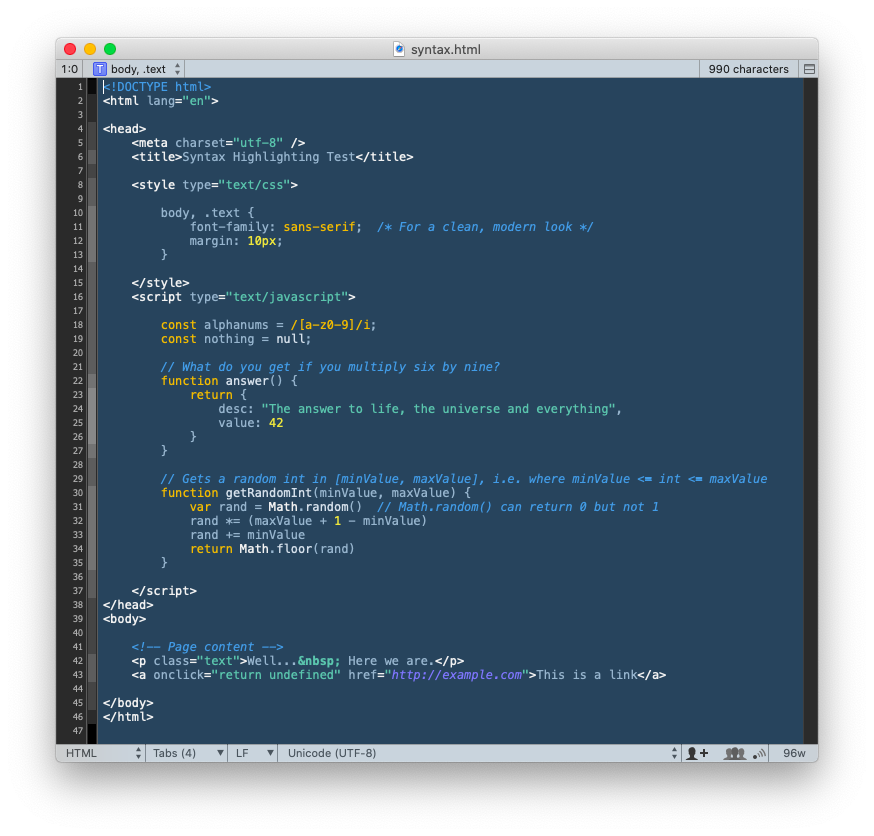

# SubEthaEdit Styles

Color themes for the excellent [SubEthaEdit text/code editor](https://subethaedit.net).

Based on the [styles that ship with SubEthaEdit](https://github.com/subethaedit/SubEthaEdit/tree/develop/SubEthaEdit-Mac/Modes/Styles), the [style sheet format docs](https://github.com/subethaedit/SubEthaEdit-Modes/blob/master/Documentation/Styles/StyleSheetFormat.md), and the [syntax scope style guide](http://htmlpreview.github.io/?https://github.com/subethaedit/SubEthaEdit-Modes/blob/master/Documentation/Styles/SEEScopeDoc.html).

### Installation

Clone this repo, then:

```bash
styles_dir="$HOME/Library/Containers/de.codingmonkeys.SubEthaEdit.Mac/Data\
/Library/Application Support/de.codingmonkeys.SubEthaEdit.Mac/Styles"

for sss in *.sss; do
  if [[ ! -e "$styles_dir/$sss" ]]; then
    ln -s "$(pwd -P)/$sss" "$styles_dir/$sss"
  fi
done
```

### Activation

In SubEthaEdit, open Preferences and select the Styles tab.   
In the dropdown at the top of the dialog, select Default (the top value), or a specific mode.   
Select the "Custom style sheet" radio button, then the desired style in the dropdown to its right.

### Screenshots

Blueby++ | J-Squared Dark | J-Squared Light
-------- | -------------- | ---------------
 |  | 
